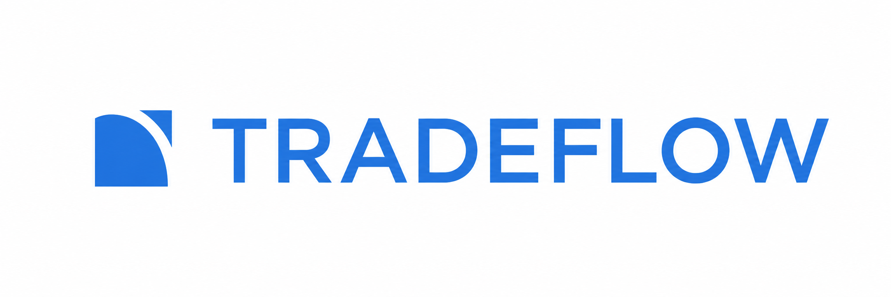
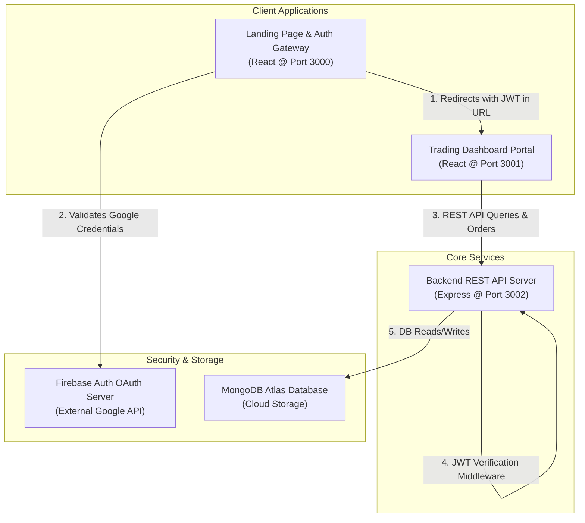

<p align="center">
  
</p>

<h1 align="center">📈 TradeFlow</h1>

<p align="center">
  <strong>A Premium, Full-Stack Simulated Stock Trading & Brokerage Ecosystem</strong>
</p>

<p align="center">
  <i>Replicating the lightning-fast user experience, order execution, and modern interface of leading discount brokerages (like Zerodha Kite & Upstox).</i>
</p>

<p align="center">
  <a href="https://react.dev/"></a>
  <a href="https://nodejs.org/"></a>
  <a href="https://expressjs.com/"></a>
  <a href="https://www.mongodb.com/atlas"></a>
  <a href="https://firebase.google.com/"></a>
  <a href="https://jestjs.io/"></a>
  <a href="https://www.docker.com/"></a>
</p>

---

## 📖 Overview

**TradeFlow** is a full-stack **stock trading and portfolio simulation platform** built for educational paper-trading, architectural study, and product demonstration. 

It replicates the lifecycle of real-world stock market trading:
*   🔍 **Market Discovery**: Real-time searchable watchlist.
*   ⚡ **Instant Execution**: Buy/sell order execution with automatic capital updating.
*   💼 **Demat Tracking**: Comprehensive holdings & active leveraged positions telemetry.
*   ⚙️ **User Personalization**: Theme toggle, currency choice, custom chart defaults, and notification profiles synced in real-time.

---

## 🚀 System Architecture & Topology

TradeFlow is architected as a decoupled, multi-origin web ecosystem consisting of three primary nodes that work in synergy:



### 🛰️ Port Allocation & Node Services
*   **Port 3000 — Frontend Marketing Gateway**: Public site showcasing products, pricing, and support, as well as the authentication gateway (Signup/Login/Google OAuth).
*   **Port 3001 — Trading Dashboard Portal**: The central trading center where users execute trades, view P&L metrics, review order logs, and manage connections.
*   **Port 3002 — Backend REST API Server**: Handles state coordination, database queries/updates, security checks, and user seeding.

---

## ✨ Features & Capabilities

*   📊 **Interactive Trading Terminal**: Real-time responsive watchlist. Hover over assets to instantly buy or sell.
*   💼 **Holdings & Positions Management**: Tracks long-term investments and active trades with real-time profit and loss (P&L) telemetry.
*   🛍️ **Mock Order Engine**: Placing trades dynamically updates cash balances, adjusts holdings/positions, and appends transaction logs.
*   🔐 **Firebase Google Sign-In**: One-click OAuth Google sign-in securely verified on the backend.
*   ⚙️ **Preference Synchronization**: Instantly sync themes (Dark/Light mode), currency, charts, and notification choices to MongoDB.
*   🎨 **Premium Dark Theme**: Fully responsive design toggling native CSS variables globally.
*   🔌 **Simulated SSO Ecosystem**: Connect to partner integrations (Smallcase, Streak, Sensibull, etc.) using a simulated OAuth flow with network latency.

---

## 🛠️ Tech Stack & Key Technologies

| Layer | Technologies & Libraries | Key Components |
| :--- | :--- | :--- |
| **Frontend (Landing)** | React 19, React Router v7, Firebase Auth Client SDK, Bootstrap 5 | [frontend/package.json](file:///c:/Users/shiva/Desktop/TradeFlow/frontend/package.json) |
| **Trading Panel** | React 19, Axios (Interceptors), Chart.js, Material-UI Icons, CSS Variables | [dashboard/package.json](file:///c:/Users/shiva/Desktop/TradeFlow/dashboard/package.json) |
| **Backend REST API** | Node.js, Express, Mongoose (MongoDB Atlas), JSON Web Token (JWT), BcryptJS | [backend/package.json](file:///c:/Users/shiva/Desktop/TradeFlow/backend/package.json), [backend/index.js](file:///c:/Users/shiva/Desktop/TradeFlow/backend/index.js) |
| **Testing Suites** | Jest, React Testing Library, `@testing-library/jest-dom` | Configured inside React App directories |
| **Deployment** | Docker, Nginx, Vercel | [docker-compose.yml](file:///c:/Users/shiva/Desktop/TradeFlow/docker-compose.yml) |

---

## ⚙️ Quick Start (Local Setup)

> [!IMPORTANT]
> Ensure you have **Node.js (v16+)** installed and a **MongoDB Connection String** ready before setting up locally.

### Step 1: Backend Server Setup
1. Navigate to the backend folder:
   ```bash
   cd backend
   npm install
   ```
2. Create a `.env` file inside [backend/](file:///c:/Users/shiva/Desktop/TradeFlow/backend) and configure it:
   ```env
   PORT=3002
   MONGO_URL=your_mongodb_connection_string
   FIREBASE_API_KEY=your_firebase_api_key
   JWT_SECRET=your_jwt_signing_secret
   ```
3. Start the server in development mode:
   ```bash
   npm start
   ```

### Step 2: Landing Page (Public Frontend) Setup
1. Navigate to the frontend folder:
   ```bash
   cd ../frontend
   npm install
   ```
2. Create a `.env` file inside [frontend/](file:///c:/Users/shiva/Desktop/TradeFlow/frontend) and configure it:
   ```env
   REACT_APP_FIREBASE_API_KEY=your_firebase_api_key
   REACT_APP_FIREBASE_AUTH_DOMAIN=your_project.firebaseapp.com
   REACT_APP_FIREBASE_PROJECT_ID=your_project_id
   REACT_APP_FIREBASE_STORAGE_BUCKET=your_project.appspot.com
   REACT_APP_FIREBASE_MESSAGING_SENDER_ID=your_sender_id
   REACT_APP_FIREBASE_APP_ID=your_app_id
   ```
3. Start the landing page application:
   ```bash
   npm start
   ```

### Step 3: Trading Dashboard Setup
1. Navigate to the dashboard folder:
   ```bash
   cd ../dashboard
   npm install
   ```
2. Start the dashboard application (runs on Port 3001):
   ```bash
   npm start
   ```

---

## 🐳 Docker Deployment

The ecosystem contains a multi-container [docker-compose.yml](file:///c:/Users/shiva/Desktop/TradeFlow/docker-compose.yml) configuration allowing you to spin up the entire platform (Frontend, Dashboard, and Backend) instantly.

### Spin up the Ecosystem
Run the following command from the root directory:
```bash
docker-compose up --build
```
This will build and launch:
*   Backend Server at `http://localhost:3002`
*   Landing Page Frontend at `http://localhost:3000`
*   Trading Dashboard at `http://localhost:3001`

---

## 🧪 Testing Suite

Automated testing is configured using **Jest** and **React Testing Library**.

*   **Run Landing Frontend Tests:**
    ```bash
    cd frontend
    npm test -- --watchAll=false
    ```
*   **Run Dashboard Portal Tests:**
    ```bash
    cd dashboard
    npm test -- --watchAll=false
    ```

---

## 📂 Developer Documentation Index

For an in-depth review of specific project components, check out the documentation files inside the `docs/` folder:

| Documentation Link | Focus & Details |
| :--- | :--- |
| 🏗️ [System Architecture Guide](file:///c:/Users/shiva/Desktop/TradeFlow/docs/ARCHITECTURE.md) | Ecosystem topology maps, data flows, and design considerations. |
| 🔐 [Authentication Guide](file:///c:/Users/shiva/Desktop/TradeFlow/docs/AUTHENTICATION.md) | Google Sign-in verification, JWT signing, and secure redirect rules. |
| ⚙️ [Settings & Theme Guide](file:///c:/Users/shiva/Desktop/TradeFlow/docs/SETTINGS_AND_THEME.md) | Sync preferences to MongoDB and implementation of native CSS Dark Mode. |
| 🔌 [Ecosystem Apps Guide](file:///c:/Users/shiva/Desktop/TradeFlow/docs/ECOSYSTEM_APPS.md) | App integration scopes, simulated SSO modals, and state persistence. |
| 🧪 [Testing Guide](file:///c:/Users/shiva/Desktop/TradeFlow/docs/TESTING.md) | Jest resolution mapping, mock files, and mock timer configurations. |
| 🗄️ [Database Design Guide](file:///c:/Users/shiva/Desktop/TradeFlow/docs/DATABASE.md) | Complete Entity-Relationship mapping, Mongoose schemas ([UserSchema.js](file:///c:/Users/shiva/Desktop/TradeFlow/backend/schemas/UserSchema.js), [HoldingsSchema.js](file:///c:/Users/shiva/Desktop/TradeFlow/backend/schemas/HoldingsSchema.js), [PositionsSchema.js](file:///c:/Users/shiva/Desktop/TradeFlow/backend/schemas/PositionsSchema.js), [OrdersSchema.js](file:///c:/Users/shiva/Desktop/TradeFlow/backend/schemas/OrdersSchema.js)), and default seeding lists. |
| 📡 [API Documentation Guide](file:///c:/Users/shiva/Desktop/TradeFlow/docs/API_DOCUMENTATION.md) | Request and response JSON structures for REST API endpoints. |

---

<p align="center">
  Made with ❤️ by Shivangi
</p>
