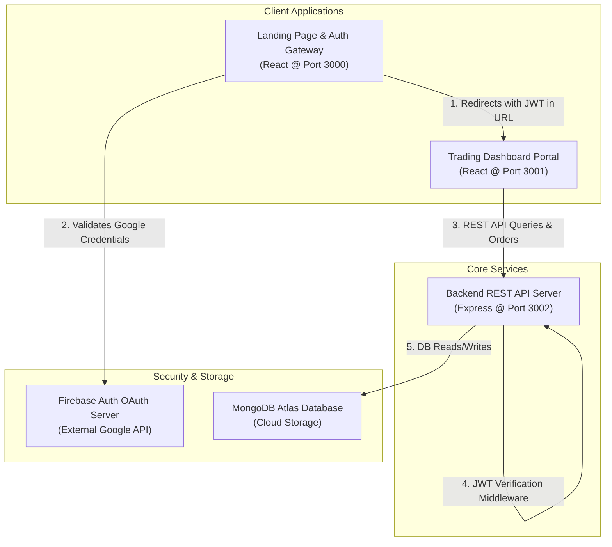
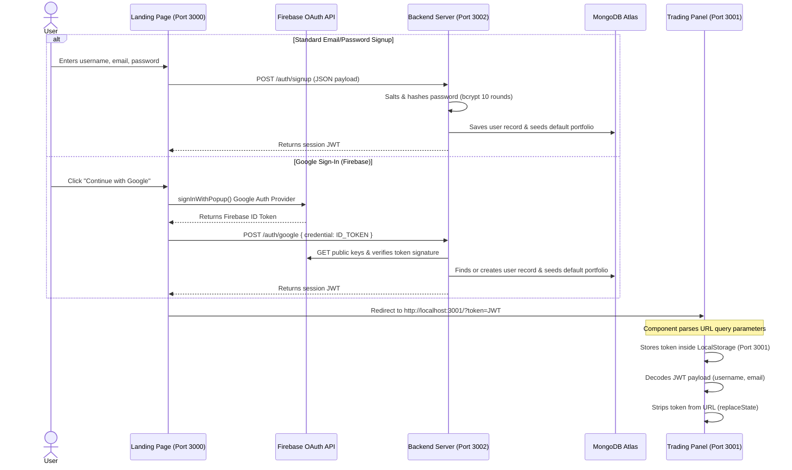
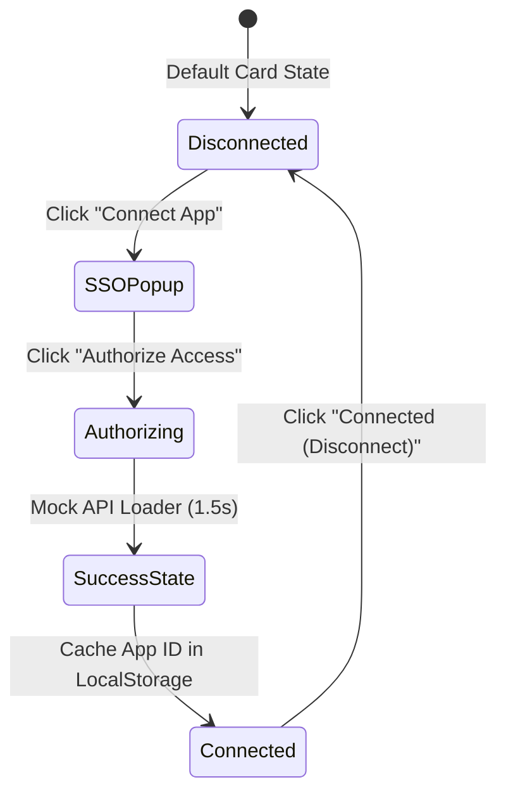

# TradeFlow Ecosystem Architecture

This document provides a comprehensive, deep-dive description of the system architecture, component design, data flows, and security protocols of the TradeFlow ecosystem.

---

## 🏛️ 1. High-Level Ecosystem Topology

TradeFlow is engineered as a decoupled, multi-origin web ecosystem consisting of three primary nodes that interact over standard HTTP and Web protocols:



### Port Allocation & Deployment Mapping
*   **Port 3000 (Frontend / Public Site):** Marketing website, information, static pages, and the gateway for sign-up and login forms.
*   **Port 3001 (Dashboard / Trading Panel):** The client app where users trade assets, manage positions, modify preferences, and integrate partner platforms.
*   **Port 3002 (API Server / Backend):** Core service handling database reads/writes, cryptography operations, and Google token verifications.

---

## 🔁 2. Core Authentication & Session Lifecycle

TradeFlow implements a stateless JWT-based session architecture, supporting both traditional email/password credentials and Google Firebase Authentication.

### Detailed Auth & Redirection Sequence



### Cross-Port Origin Isolation Strategy
To prevent stale credentials desynchronization across ports:
1.  **Stateless Frontend:** The landing page on port `3000` is completely stateless. It does not cache the session token in its own local storage.
2.  **Dashboard Ingestion:** The dashboard on port `3001` receives the JWT via a secure query parameter, parses it, and caches it in the port `3001` local storage.
3.  **Clean Logouts:** When logging out, the dashboard clears the token, username, and email from port `3001` local storage, then redirects the browser to `http://localhost:3000`, returning the user to the public landing site.

---

## 🗄️ 3. Database Schema & Seeding Systems

TradeFlow connects to MongoDB via the Mongoose ODM to model user profiles, preferences, and portfolio data.

### Database Schema Definitions
*   **Users Collection (`UserSchema.js`):** Stores username, email, and password hashes, along with nested preferences (`theme`, `currency`, `chartType`, `notifications`). The email field contains a `unique` index constraint.
*   **Holdings Collection (`HoldingsSchema.js`):** Links shares owned in demat accounts to specific user `ObjectIds`. Includes fields for symbol name, quantity (`qty`), purchase average (`avg`), and market price.
*   **Positions Collection (`PositionsSchema.js`):** Tracks active, leveraged trades. Includes fields for product type (`CNC` / `MIS`), isLoss boolean indicator, and price changes.
*   **Orders Collection (`OrdersSchema.js`):** A transactional history log recording stock trades (`BUY` / `SELL`), quantities, execution prices, and timestamps.

### Automatic Database Seeding
Upon a new user's first-time login or signup, the backend calls the `seedUserData` helper to automatically populate:
*   **13 Default Stock Holdings:** (Bharti Airtel, HDFC Bank, Hindustan Unilever, Infosys, ITC, KPIT, Mahindra & Mahindra, Reliance, SBI, Sovereign Gold Bond, Tata Power, TCS, and Wipro).
*   **2 Active Positions:** (Eveready, Domino's).
*   **Historical Orders:** Buy transactions corresponding to the seeded holdings.

---

## 🔌 4. Ecosystem Partner Apps & SSO Integration

The **Apps** tab integrates third-party tools (such as Smallcase, Sensibull, Streak, GoldenPi, and Tijori Finance) using a simulated Single Sign-On (SSO) authorization flow.

### SSO Flow Diagram



*   **OAuth Authorization Modal:** Displays the permission scopes requested by the app (e.g. view holdings, place orders).
*   **Mock Network Latency:** Simulates API communication with a 1.5s loading spinner, followed by a checkmark success screen.
*   **LocalStorage Syncing:** Saves connected App IDs inside `localStorage.setItem("tradeflow_connected_apps", ...)` to ensure integrations remain active across refreshes.

---

## 🔒 5. Network & API Security Policies

### CORS Configuration
Cross-Origin Resource Sharing (CORS) is enabled globally on the API server to allow clients on ports `3000` and `3001` to safely execute HTTP operations:
```javascript
app.use(cors());
```

### JWT Validation Middleware (`authenticateToken`)
Incoming requests targeting settings or portfolio data are processed by the token verifier:
1.  Extracts the `Authorization: Bearer <TOKEN>` header.
2.  Validates the token signature using the server's `JWT_SECRET`.
3.  Mounts the decoded user payload to `req.user` for controller execution.
4.  Rejects requests missing or containing invalid tokens with `401 Unauthorized`.

### Axios HTTP Request/Response Interceptors
The trading dashboard (`dashboard/src/index.js`) configures global interceptors:
*   **Request Interceptor:** Automatically injects the active token from local storage into the `Authorization` header of all outgoing Axios calls.
*   **Response Interceptor:** If any API response returns a `401 Unauthorized` status (due to token expiration or invalidity), the interceptor automatically clears the local credentials cache and redirects the user to the public landing page login.

---

## 🧪 6. Automated Testing Architecture

Testing is managed using **Jest** and **React Testing Library** to validate authentication routes, UI rendering, filters, settings updates, and connection events.

### Test Setup Configurations
1.  **Global DOM Matchers (`setupTests.js`):** Automatically loads `@testing-library/jest-dom` in Jest environments to support custom DOM assertions like `toBeInTheDocument()`.
2.  **CRA Jest Resolution Mapping:** Configures Jest `moduleNameMapper` inside `package.json` to resolve React Router 7's modern conditional exports:
    ```json
    "jest": {
      "moduleNameMapper": {
        "^react-router-dom$": "<rootDir>/node_modules/react-router-dom/dist/index.js"
      }
    }
    ```
3.  **Fake Timer Implementations (`Apps.test.js`):** Replaces Jest's real timers with fake timers (`jest.useFakeTimers()`) and wraps time advancements (`jest.advanceTimersByTime`) inside React Test Utils `act()` blocks. This tests nested, asynchronous `setTimeout` flows synchronously and instantly.
