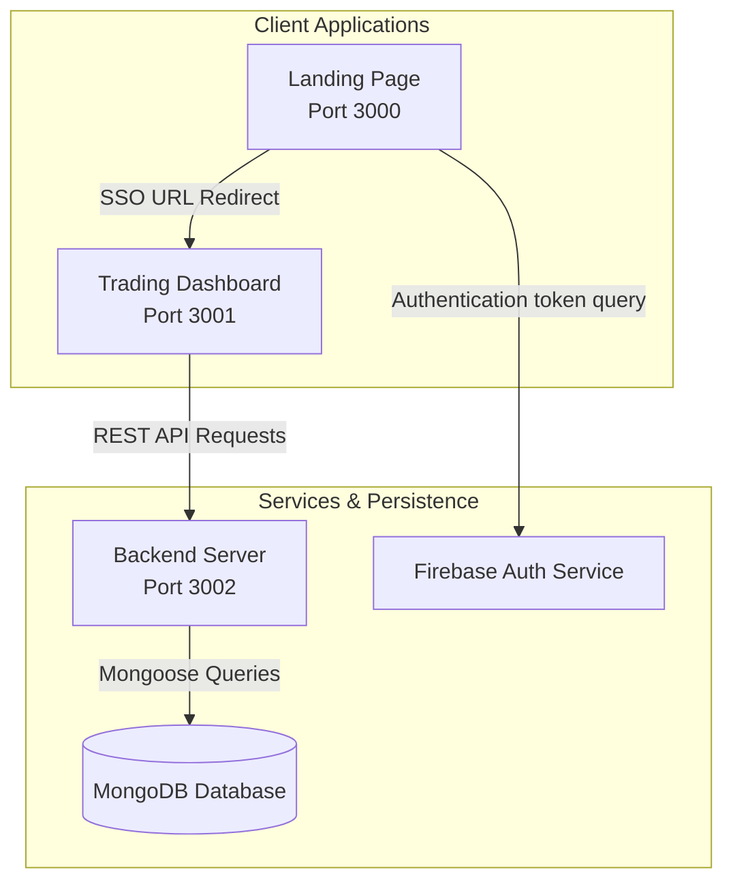

# TradeFlow System Architecture

This document describes the high-level architecture, module interaction, and data flows of the TradeFlow ecosystem.

---

## 🏛️ Ecosystem Architecture

TradeFlow is structured as a decoupled multi-tier architecture consisting of three primary nodes:

---

## 🧩 Component Node Responsibilities

### 1. Frontend Landing Page (Port 3000)
- **Role:** Customer-facing marketing platform and gateway to credentials management.
- **Tech Stack:** React 19, React Router v7, Vanilla CSS, Firebase Client SDK.
- **Primary Pages:** Home/Hero, About, Products, Pricing, Support, Login, Signup.
- **Security Scope:** Bypasses local state persistence. Submits login/signup actions, retrieves session credentials, and redirects immediately to the Dashboard origin.

### 2. Trading Dashboard (Port 3001)
- **Role:** Interactive brokerage portal displaying live trading data and profile controls.
- **Tech Stack:** React 19, Axios, Chart.js, MUI Icons, Vanilla CSS.
- **Primary Pages:** Summary Analytics, Orders log, Holdings table, Positions tracker, Profile settings panel, Ecosystem Apps grid.
- **Security Scope:** Receives tokens through URL queries on mount, stores tokens securely inside its own local storage, and injects Authorization headers in all outgoing requests via Axios interceptors.

### 3. Backend Server (Port 3002)
- **Role:** Data provider and authentication coordinator.
- **Tech Stack:** Node.js, Express, Mongoose (MongoDB driver), jsonwebtoken, bcryptjs.
- **Primary Modules:** Security middlewares (JWT verification, Firebase signature validation), Database models (Users, Settings, Holdings, Positions, Orders), automatic portfolio seeder.

---

## 🔁 Key Data Flows

### 1. User Authentication Flow
1. User requests Google Sign-In on Port 3000.
2. Firebase SDK handles OAuth popup and returns an ID Token.
3. Port 3000 posts the ID Token to Port 3002.
4. Backend verifies the signature against Firebase servers.
5. Backend signs a local JWT containing the user's ID, username, and email.
6. Backend responds with the JWT, and Port 3000 redirects to `http://localhost:3001/?token=JWT`.

### 2. Settings Synchronization & Theme Rendering
1. User updates theme to "Dark" inside Dashboard Settings on Port 3001.
2. Port 3001 sends a PUT request containing the modified preference payload to Port 3002.
3. Backend updates the user preference document inside MongoDB.
4. Port 3001 updates the active React states and appends the `.dark-theme` CSS class directly to `document.body` for responsive, global visual updates.

### 3. Portfolio & Trading Data Flows
1. When the Dashboard mounts, the context providers make GET requests (`/allHoldings`, `/allPositions`, `/allOrders`) to Port 3002.
2. The Backend intercepts requests via `authenticateToken`, extracting the user's `userId` from the JWT payload.
3. The Backend queries MongoDB filtering by the `user` reference field and returns the user-specific portfolio.
4. When a user clicks **Buy** or **Sell** on a stock watchlist item, the component sends a `POST /newOrder` request containing the transaction payload.
5. The Backend creates a Mongoose document inside the `orders` collection, updates the portfolio records, and returns a 201 status.

### 4. Ecosystem Partner Apps SSO Integration
1. User navigates to `/apps` and clicks **Connect App** on a card.
2. A React state modal opens simulating OAuth scopes requests.
3. Clicking **Authorize** runs a loader for 1.5 seconds, then saves the authorized App ID inside `localStorage` on Port 3001.
4. The connection state is persisted in localStorage, allowing the card to render as **Connected** on subsequent mounts.

---

## 🔒 Cross-Port Session Interceptors

To maintain secure, seamless communication across separate origins:
- **Token Decoupling:** The landing site (Port 3000) does not cache the session token in its own `localStorage` to avoid stale credentials desynchronization.
- **Axios Global Interceptor (`dashboard/src/index.js`):** Intercepts all outgoing XMLHttpRequests, appending the active JWT token inside the `Authorization: Bearer <token>` header.
- **401 Redirect Interceptor:** If the backend returns a `401 Unauthorized` status (due to token expiration or invalid signature), the interceptor automatically clears the local credentials cache and redirects the browser back to `http://localhost:3000/login`.

