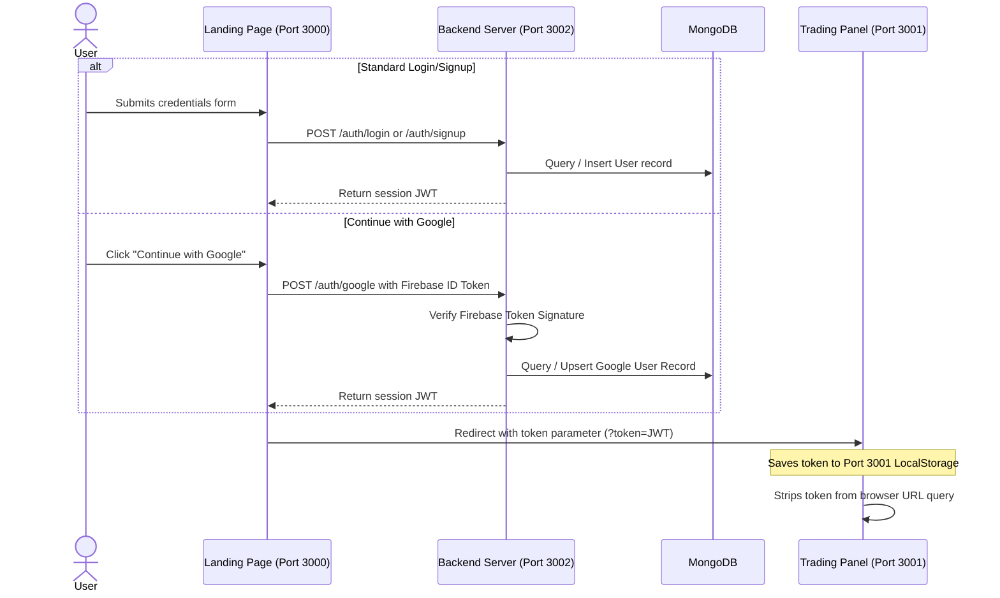

# Authentication Architecture & Cross-Origin Session Redirection

TradeFlow uses a hybrid authentication system supporting standard credentials (email/password) and third-party Firebase Google Sign-In.

---

## Session Lifecycle Overview



---

## Core Authentication Workflows

### 1. Traditional Signup & Login
- **Signup Endpoint (`POST /auth/signup`):** Receives username, email, and password. It checks database uniqueness, salts and hashes the password using `bcryptjs` with 10 rounds, writes the user to MongoDB, seeds initial mock holdings/positions, and signs a JWT.
- **Login Endpoint (`POST /auth/login`):** Validates email against existing accounts, compares the submitted password against the stored bcrypt hash, and signs a session JWT valid for 7 days.

### 2. Firebase Google Sign-In
- **Frontend popup:** Uses Firebase's `signInWithPopup` to securely prompt the user to choose their Google account.
- **ID Token Retrieval:** Obtains the secure Google ID Token from Firebase client-side via `getIdToken()`.
- **Backend Verification (`POST /auth/google`):** Posts the token to the backend, which verifies the token signature against Google's public keys via the Firebase Auth verification API.
- **User Upsert:** If valid, the backend creates a user record (if new) or fetches the existing user, signing and returning a TradeFlow session JWT.

### 3. Cross-Origin Redirect Flow (Port 3000 to Port 3001)
Since the landing page and the trading dashboard operate on different ports, they are separate origins, meaning they cannot access each other's `localStorage` directly.
- **Redirection:** Upon login success on port `3000`, the page redirects using:
  ```javascript
  window.location.href = `http://localhost:3001/?token=${data.token}`;
  ```
- **Ingestion:** The Dashboard (`Home.js` on port `3001`) detects the `?token` query string inside its `useEffect` mounting lifecycle, saves it to the dashboard origin's `localStorage`, decodes the payload parameters (username, email) client-side, and then strips the token from the address bar for security:
  ```javascript
  window.history.replaceState({}, document.title, window.location.pathname);
  ```

---

## Developer Mock Bypass Mode
For zero-config local development where Firebase is not yet set up:
- If `.env` contains placeholders, the frontend automatically bypasses the Google popup and sends a mock token string (`MOCK_DEVELOPER_GOOGLE_TOKEN`).
- The backend recognizes the mock token, bypasses signature verification, and creates/authenticates a local test account (`google_developer@tradeflow.com`), seeding the database.
