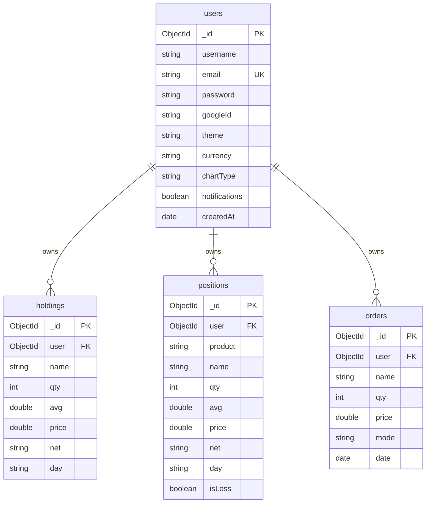

# MongoDB Database & Schema Design

TradeFlow uses a **MongoDB** database to persist user details, profiles, and trading data (Holdings, Positions, and Orders) linked by Mongoose schemas.

---

## Entity-Relationship Mapping

All collection schemas link to the `users` table via `Schema.Types.ObjectId` references:

---

## Schema Declarations

### 1. User Schema (`UserSchema.js`)
Stores the primary authentication credentials alongside custom visual/preference state controls:
*   `email` has an index constraint (`unique: true`) for performance and to prevent duplicate accounts.
*   `password` remains optional to accommodate Google OAuth profiles.

### 2. Holdings Schema (`HoldingsSchema.js`)
Represents stock shares purchased and held in the demat account:
*   `user` (ref: `"user"`): Owner of the stock.
*   `name`: Ticker symbol (e.g. `INFY`, `RELIANCE`).
*   `avg` & `price`: Purchase average price and current market trading price.

### 3. Positions Schema (`PositionsSchema.js`)
Represents active, intraday, or delivery leveraged trade positions:
*   `product`: Type of position (e.g., `CNC`, `MIS`).
*   `isLoss`: Boolean to quickly determine negative P&L colors on dashboard mounts.

### 4. Orders Schema (`OrdersSchema.js`)
A transactional log of completed and pending trades placed:
*   `mode`: Order execution type (`BUY` or `SELL`).
*   `date`: Execution timestamp.

---

## Automatic Portfolio Seeding

When a user signs up (via email or Google Sign-In) for the first time, a helper function seeds their account in MongoDB to ensure they see a realistic trading portfolio immediately.

**Seeded Data List:**
*   **Default Holdings:** Seeds 13 primary Indian stock listings: Bharti Airtel (`BHARTIARTL`), HDFC Bank (`HDFCBANK`), Hindustan Unilever (`HINDUNILVR`), Infosys (`INFY`), ITC, KPIT Technologies (`KPITTECH`), Mahindra & Mahindra (`M&M`), Reliance Industries (`RELIANCE`), State Bank of India (`SBIN`), Sovereign Gold Bond (`SGBMAY29`), Tata Power (`TATAPOWER`), TCS, and Wipro (`WIPRO`).
*   **Default Positions:** Seeds active open trading positions in Eveready (`EVEREADY`) and Domino's (`JUBLFOOD`).
*   **Default Orders:** Initial historical buy orders for the seeded assets are generated to fill logs.
